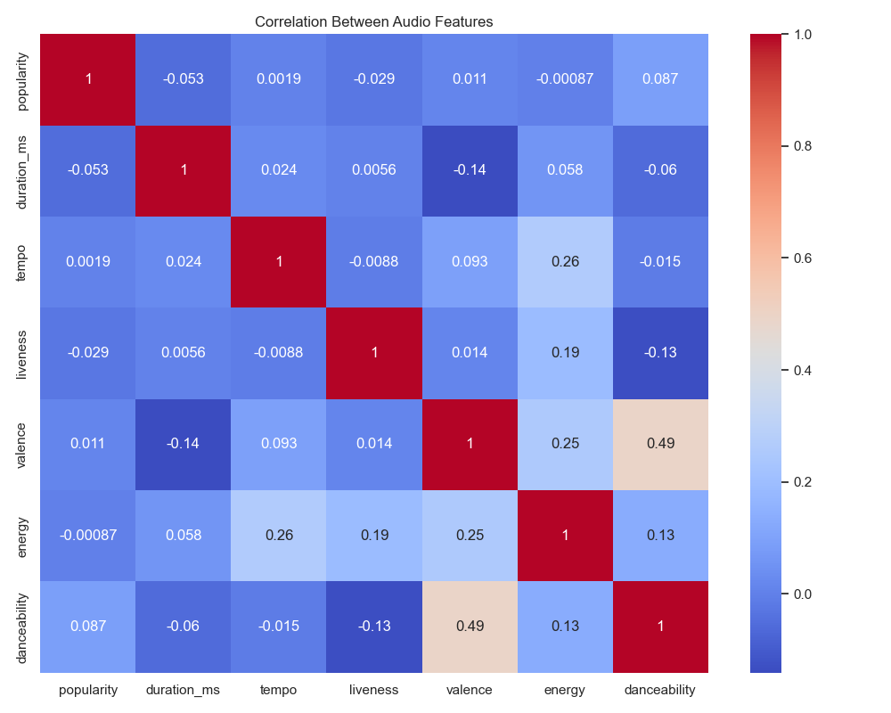
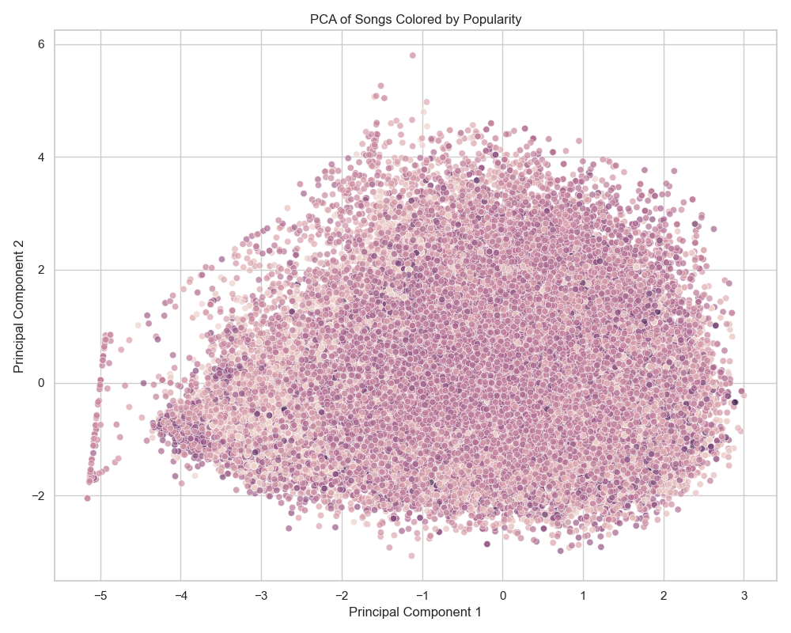
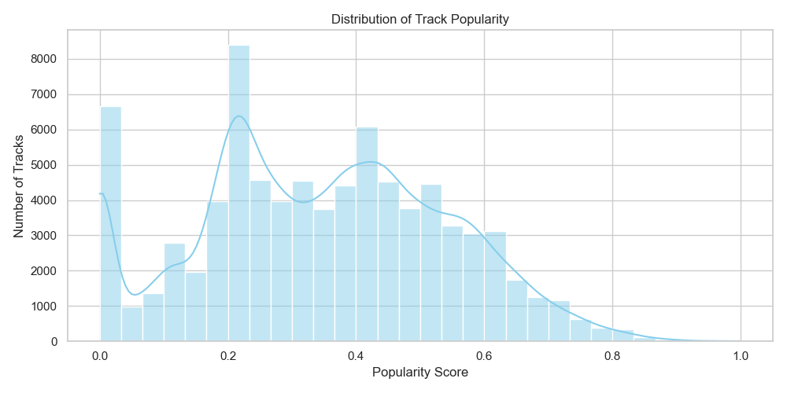
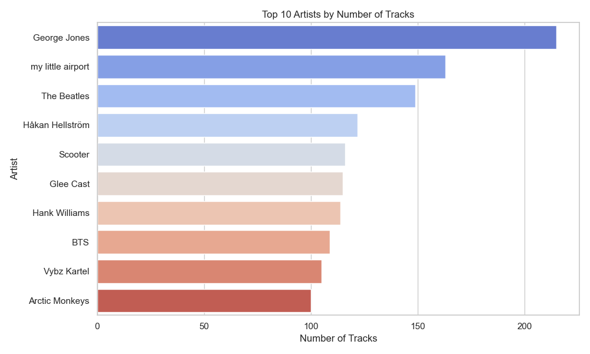
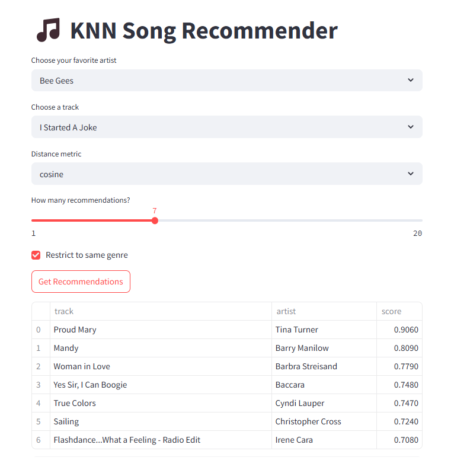
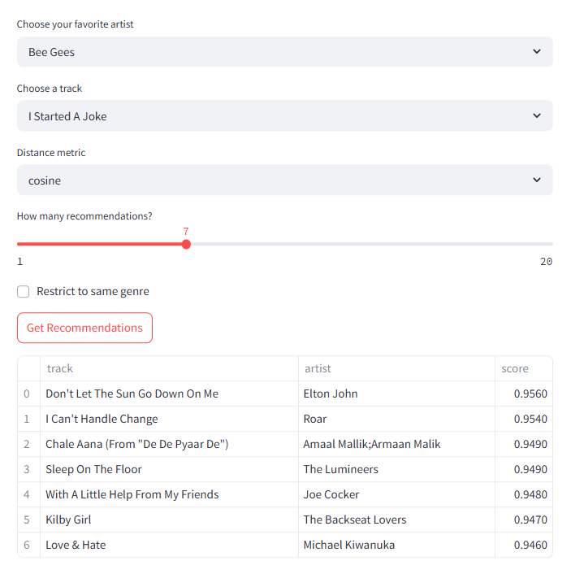

# CS506-Project

## Final Report

# 🎵 Song Recommendation System with KNN

This project is a modular, K-Nearest Neighbors (KNN)-based song recommender system built with Python. It includes:

- **`dataprocess.ipynb`**: Handles data processing, cleaning, and feature scaling.
- **`recommender.py`**: A CLI tool to recommend similar songs using audio features.
- **`app.py`**: A Streamlit web application for interactive song recommendations.

---

## 📁 Project Structure

```text
├── dataprocess.ipynb    # Data processing and feature extraction
├── recommender.py       # KNN-based recommender via command-line
├── app.py               # Streamlit front-end for recommendations
├── dataset.csv          # (Required) Dataset containing audio features
```


**How to build and run the code:**
# 🎵 How to Run and Use the KNN Song Recommendation System

This guide explains how to set up and run the KNN-based song recommendation system using both command-line and Streamlit interface.

---

## 📁 Project Files

- `dataprocess.ipynb`: Jupyter Notebook to process and clean the dataset.
- `recommender.py`: Python script for command-line based recommendations.
- `app.py`: Streamlit app for interactive song recommendation.
- `dataset.csv`: CSV file of audio features (either generated or downloaded).

---

## ✅ Requirements

You need Python 3.7 or higher. Install the required dependencies using the following command in Terminal:

`pip install pandas numpy scikit-learn streamlit`


---

##  Step 1: Prepare the Dataset

Open and run `dataprocess.ipynb` to clean and preprocess your dataset. This notebook should output a cleaned `dataset.csv` file with numeric features and genre codes.

---

##  Step 2: Run from the Command Line

Use `recommender.py` to find similar songs from the terminal:

`python recommender.py --dataset dataset.csv
--song "Shape of You"
--artist "Ed Sheeran"
--n_songs 5
--metric cosine
--same_genre
`


**Arguments:**
- `--dataset`: Path to the dataset CSV
- `--song`: Song name (exact match required)
- `--artist`: Artist name (exact match required)
- `--n_songs`: Number of similar songs to return
- `--metric`: Distance metric (`cosine`, `euclidean`, or `manhattan`)
- `--same_genre`: Optional flag to restrict results to the same genre

---

## Step 3: Use the Streamlit App

To launch the web interface, run:

`streamlit run app.py`


Then in the browser:
- Choose your favorite artist and song from dropdowns
- Select a distance metric
- Adjust the number of recommendations
- Optionally filter by same genre
- Click "Get Recommendations" to see results in a table

---


Here is the feature correlation heatchart, which gives scores for the correlation in similarity between songs with specific attributes. This helps us identify which attributes are closely correlated. For example, we observe a strong correlation between 'valance' and 'danceability', suggesting that more positive songs tend to be more danceable. These are useful when we apply it to our recommendation model and do Principal Component Analysis (PCA).


Here is the PCA plot colored by 'popularity'. To better visualize the dataset, we performed a PCA using audio-numerical features (loudness, valance, danceability, etc.). The PCA reduces these dimensions into two components:
- **PC1** captures the most variance and reflects energy, loudness, and acousticness.
- **PC2** reflects variation in valence, danceability, and duration.


Here is the distribution of the songs by their popularity scores:


Here is a chart of the top artists, which is determined by their number of tracks:


## Data Processing and Cleaning

We chose to use a **Kaggle dataset** instead of the **Spotify API** primarily because we don’t have a database infrastructure to store large volumes of data returned by the API. If we were to manually select a subset of songs from Spotify, it could introduce bias — for instance, favoring certain genres unintentionally. This would lead to **underfitting** during model evaluation, especially for underrepresented genres or song types. Also, Spotify removed the ability for users to access data about each individual song's audio features, meaning that as of now we'd only be able to access the necessary information for our model using the Spotify API.

To avoid any difficulties, we selected the [Spotify Tracks Dataset on Kaggle](https://www.kaggle.com/datasets/maharshipandya/-spotify-tracks-dataset), which includes around **11,000 tracks** across **125 different genres**. Each track includes multiple audio features such as danceability, energy, acousticness, and more. The data is stored in **CSV format**, making it easy to load, explore, and preprocess.

---

### Cleaning Steps

- **Drop unnecessary columns**:
  - `Unnamed` index column: redundant since CSV already includes an index.
  - `track_id`: just a unique identifier, not needed for modeling.
  - `album_name`: we retain only artist and song name for simplicity.

- **Remove nulls and duplicates**:
  - Any rows with missing values are removed.
  - Duplicate songs (i.e., same `artist_name` and `track_name`) are dropped. This accounts for cases where artists release the same song in different albums.

- **Feature Standardization**:
  - All numerical features used for prediction are scaled to a [0, 1] range. This ensures consistent weighting across features and improves model performance.

- **Genre Encoding**:
  - The `genre` column (string) is encoded into numeric labels for model training.
  - We retain the original `genre` column for reference.
  - A dictionary (`genre_mapping`) is created to map numeric labels back to genre names.  
    You can print it using:
    ```python
    print(genre_mapping.to_string(index=False))
    ```
---

## Data Modeling Methods
We used multiple techniques to model our data. We used bar charts to measure the popularity of the individual artists and songs, based on their number of songs and views respectively. We also used a principal component analysis chart to measure the variance in attributes for the individual songs, with the PC1 weighing the similarity of the songs based on their loudness, energy, and acousticness, and PC2 weighing the similarity of the songs based on their valence, danceability, and duration. This way, we were able to see how close the songs were based on their closeness on the chart, which we used to determine which attributes to use in the actual song recommender. Similarily, the heatmap for Feature Correllation helped us figure out which song features correllated the most in terms of song similarity.

--- 

## Making Predictions
Our model used a recommender function with the KNN Model to give similar recommendations based on the song similarities; if a song isn't in the database, than the model won't return anything. The model also has a second recommender function that takes the songs' genres into account when calculating similarities. We found that using all of the available audio features resulted in the most accurate results, and so that is what our final application uses. The features are standardized using the StandardScaler, which standardizes all of the features to equivalent scales to give them equal weight when calculating similarity distances. The StandardScaler score of a sample x is calculated as z=(x-u)/s, where x is the sample, u is the mean of the training samples, and a is the standard deviation. (Whether or not genre is scaled as a feature depends on whether the user selects it or not.)

## Results

Our final results proved to be far more accurate than our preliminary results, where we only utilized a few key features. While cosine distance yields the most accurate results, we've found that for many cases, using euclidean and manhattan distances often returns similar (if not always exact) results. And even without the genre feature turned on, the KNN audio features prove reasonably accurate at finding songs that are similar in, for instance, the decade they were released in, or songs from the same artists.


---


# Midterm Report
Youtube link for presentation: https://youtu.be/TzdCKnKCzHM

---

### Tools and Libraries Used
- Pandas
- NumPy
- kagglehub
- Seaborn / Matplotlib
- scikit-learn (for PCA)
- Jupyter Notebook
