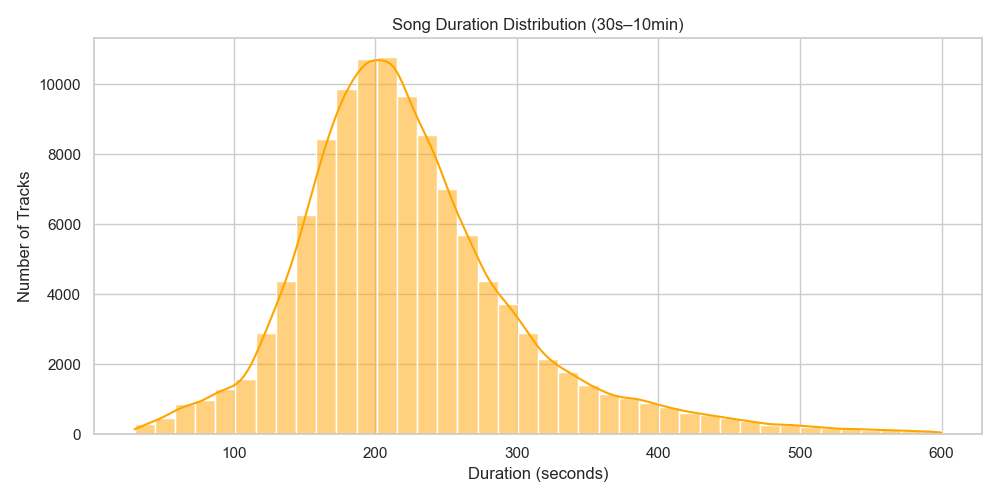

# CS506-Project

## Music Recommendation Model Proposal

**Project Overview:**
We propose a system that will recommend songs to the user based on the categories of the songs that they have listened to, such as genre and artist. Using data taken from the Spotify API, the application will recommend 15 to 20 songs at a time, as well as display a cluster chart - where the songs are gouped via KNN (K-Nearest Neightbors) - that the user can interact with to see which songs share similarities among each other.

**Goals:**
The goal of this project is to build an interactive music recommendation system using K-Nearest Neighbors (KNN). The system will allow users to select songs and visually see how the algorithm finds the most similar songs based on Spotify audio features.

**Data Collection:**
We will use Spotify’s Web API to fetch song metadata and audio features. The API provides detailed track analysis, which we can extract using Python.

**Model Selection & Training:**
Since we are recommending songs based on similarity, we will use K-Nearest Neighbors (KNN) to find the closest songs based on audio features.
What will the model do:
- Preprocessing: it will normalize the features for consistency
- Train KNN model on Euclidean distance or Cosine similarity to measure similarity.
- When a user selects a song, find the K most similar songs. (We will determine k later)
- Show a step-by-step visualization of how the KNN model finds similar songs.

**Data Visualization:**
We will create an interactive visualization that dynamically demonstrates how a song is found using K-Nearest Neighbors (KNN). Factors that will determine the location of the data points (as well as their proximity to other, "similar" points) include the song's genre, artist, length and so forth. The more of these factors that separate data points share, the closer that they will be to one another on the graph.

**Test & Evaluation Plan:**
To efficiently test and evaluate the recommendation model, we will use a straightforward approach with data splitting, key evaluation metrics, and a basic implementation:
1. **Data Splitting**: we will split the dataset into training and test sets with 80% data is used as training for model learning while 20% data is used as testing for evaluation.
2. **Generating Recommendations**: After the model has been trained, we generate Top-K song recommendations for users using this assumed function **generate_recommendations(user_id, K)** that returns a list of **K recommended songs** for a given user
3. **Precision@K & Recall@K**:
   - Precision@K:
     - Measure how many of the top K recommended songs are relevant
     - Formula: $$Precision@K = \frac{\text{Relevant Items in Top K}}{K}$$
     - E.g. If 2 out of 5 recommended songs are relevant -- Precision@5 = 2/5 = 0.4 (40%)
    - Recall@K:
      - Measure how well the recommendations cover all possible relevant songs
      - Formula: $$Recall@K = \frac{\text{Relevant Recommendations in Top K}}{\text{Total Relevant songs}}$$
      - E.g. If 10 songs are relevant, and the system suggests 2 in the top 5 possible relevent songs -- Recall@5 = 2 / 10 = 0.2 (20%)
     
4. **NDCG@K for Ranking Quality**: NDCG (Normalized Discounted Cumulative Gain) is a metric used to measure the quality of a ranking system. It compares rankings to an ideal order where all relevant items are at the top of the list. In our test, we use NDCG to give higher weight to relevant songs appearing earlier in the recommendation list.
5. **Compute Mean Scores for All Users**: We test our model reliability across multiple users and calculate average scores.
   1. Traversing all user data in the test set
   2. Compute Precision@K, Recall@K, and NCDG@K
   3. Weight and average the results for an overall model evaluation

# Midterm Report
Youtube link for presentation: https://youtu.be/TzdCKnKCzHM

--- 

## Data Processing and Cleaning

We chose to use a **Kaggle dataset** instead of the **Spotify API** primarily because we don’t have a database infrastructure to store large volumes of data returned by the API. If we were to manually select a subset of songs from Spotify, it could introduce bias — for instance, favoring certain genres unintentionally. This would lead to **underfitting** during model evaluation, especially for underrepresented genres or song types.

To avoid that, we selected the [Spotify Tracks Dataset on Kaggle](https://www.kaggle.com/datasets/maharshipandya/-spotify-tracks-dataset), which includes around **11,000 tracks** across **125 different genres**. Each track includes multiple audio features such as danceability, energy, acousticness, and more. The data is stored in **CSV format**, making it easy to load, explore, and preprocess.

---

### Cleaning Steps

- **Drop unnecessary columns**:
  - `Unnamed` index column: redundant since CSV already includes an index.
  - `track_id`: just a unique identifier, not needed for modeling.
  - `album_name`: we retain only artist and song name for simplicity.

- **Remove nulls and duplicates**:
  - Any rows with missing values are removed.
  - Duplicate songs (i.e., same `artist_name` and `track_name`) are dropped. This accounts for cases where artists release the same song in different albums.

- **Feature Standardization**:
  - All numerical features used for prediction are scaled to a [0, 1] range. This ensures consistent weighting across features and improves model performance.

- **Genre Encoding**:
  - The `genre` column (string) is encoded into numeric labels for model training.
  - We retain the original `genre` column for reference.
  - A dictionary (`genre_mapping`) is created to map numeric labels back to genre names.  
    You can print it using:
    ```python
    print(genre_mapping.to_string(index=False))
    ```

---

## Preliminary Visualizations of Data

Here is our chart of the duration distribution, listing the songs by their respective runtimes:


Here is the feature correlation heatchart, which gives scores for the correlation in similarity between songs with specific attributes:


Here is the PCA by popularity chart, with PC1 weighing more on loudness, energy, and acousticness, and PC2 weighing more on valence, danceability, and duration.


Here is the distribution of the songs by their popularity scores:


Here is a chart of the top artists, which is determined by their number of tracks:


---


## Data Modeling Methods
We used multiple techniques to model our data. We used bar charts to measure the popularity of the individual artists and songs, based on their number of songs and views respectively. We also used a principal component analysis chart to measure the variance in attributes for the individual songs, with the PC1 weighing the similarity of the songs based on their loudness, energy, and acousticness, and PC2 weighing the similarity of the songs based on their valence, danceability, and duration. This way, we were able to see how close the songs were based on their closeness on the chart, which we used to determine which attributes to use in the actual song recommender. Similarily, the heatmap for Feature Correllation helped us figure out which song features correllated the most in terms of song similarity.

---

## Preliminary Results
In our data visualization, we have found that certain features in the songs that we've tested have certain attributes have yielded far more accurate results. If we look at the heatmap in "pca_by_popularity", we can see that there is a heavy correlation between certain attributes relative to others. For instance, "valence" and "danceability" have the highest correlation between each other, at 0.48, and in theory should yield the closest results. Whereas using variables such as "popularity" yielded less-similar results, due to many less-popular songs different heavily in style, genre, and other factors. That said, using audio features on their own doesn't yield the most accurate results for recommending similar songs; for instance, applying "valence" and "danceability" alone to "Can't Help Falling in Love" by Kina Grannis gave us recommendations that were far removed from the original song, such as a non-vocal piano piece "Lyric Pieces III" by Edvard Grieg. Pairing the audio features with "genre" in our KNN-features yielded far more accurate results, with recommendations that were more similar to the given songs. (Using "artist" as a KNN-feature led to a lack of variety in the recommendations.) Even with these improvements, the recommendation system offers mixed results when it comes to offering recommendations for individual songs; if we looked at the song's locations on the correllation map, the distance between the songs varied heavily. We still have plenty of cleaning to do; we might end up standarizing the data to account for columns that aren't ranked on a 0-1 scale (such as tempo). Also, we might end up switching to cosine distance to measure the song differences instead of euclidean, as the former method accounts for the direction of the data as well as the length. And we will focus on implementing more nuanced ways of evaluating similarities between songs moving forward. 

