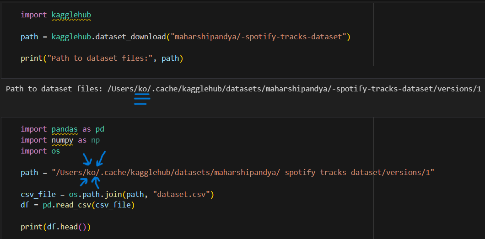
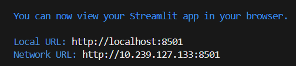
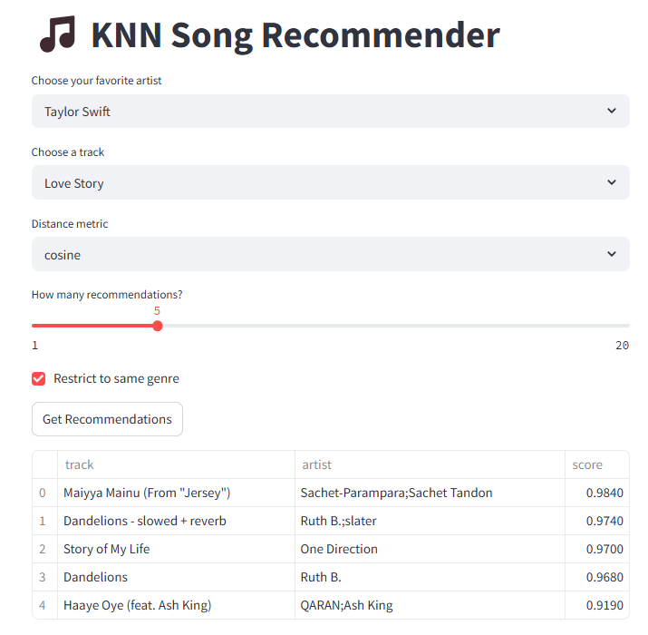
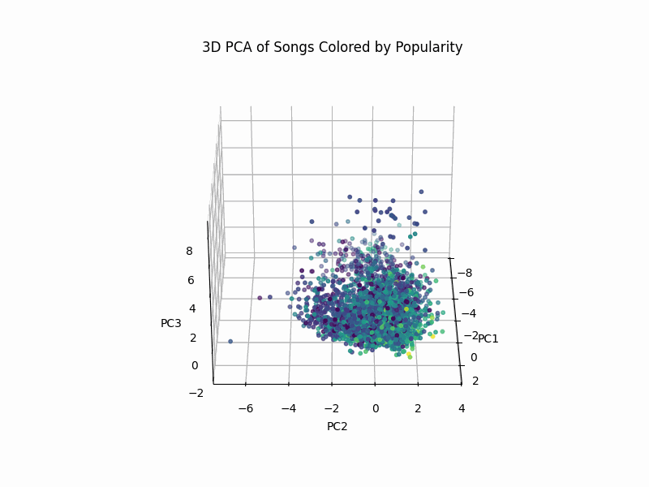

# CS506-Project

## Final Report

**How to build and run the code:**

First, go to code.ipynb and change the name in path after "Users/" (as of 4/21, it is called "ko") to whatever your computer's username is. Next, run every block of code in cody.ipynb to clean up the information scraped from the kaggle dataset, and save the cleaned data as "dataset.csv". (If you name the csv something else, you will have to change the name in every file which runs it.)

Next, open the project folder in a terminal and run "python app.py", followed by "streamlit run app.py". Finally, click the "Local URL" button that pops up to run the app in a browser.

Once the KNN Song Recommender has loaded, choose an artist, music track, the distance metric that you want to use to measure song similarity - we recommend that you use the default choice of cosine, as it measures direction as well as distance, but euclidean and manhattan distance are also listed as options too - and the number of similar song recommendations you want to receive, on a scale of 1 to 20 songs. There is also an option to restrict the songs to the same genre; once you have made your choices, hit the Get Recommendations button to receive the selected number of songs most similar to the one that you chose.

## Visualizations of Data
Here is an interactive graph of the dataset songs colored by their popularity:


Here is a 3D PCA graph of our songs colored by their popularity:


Here is our chart of the duration distribution, listing the songs by their respective runtimes:


Here is the feature correlation heatchart, which gives scores for the correlation in similarity between songs with specific attributes. This helps us identify which attributes are closely correlated. For example, we observe a strong correlation between 'valance' and 'danceability', suggesting that more positive songs tend to be more danceable. These are useful when we apply it to our recommendation model and do Principal Component Analysis (PCA).


Here is the PCA plot colored by 'popularity'. To better visualize the dataset, we performed a PCA using audio-numerical features (loudness, valance, danceability, etc.). The PCA reduces these dimensions into two components:
- **PC1** captures the most variance and reflects energy, loudness, and acousticness.
- **PC2** reflects variation in valence, danceability, and duration.


Here is the distribution of the songs by their popularity scores:


Here is a chart of the top artists, which is determined by their number of tracks:


## Data Processing and Cleaning

We chose to use a **Kaggle dataset** instead of the **Spotify API** primarily because we don’t have a database infrastructure to store large volumes of data returned by the API. If we were to manually select a subset of songs from Spotify, it could introduce bias — for instance, favoring certain genres unintentionally. This would lead to **underfitting** during model evaluation, especially for underrepresented genres or song types. Also, Spotify removed the ability for users to access data about each individual song's audio features, meaning that as of now we'd only be able to access the necessary information for our model using the Spotify API.

To avoid any difficulties, we selected the [Spotify Tracks Dataset on Kaggle](https://www.kaggle.com/datasets/maharshipandya/-spotify-tracks-dataset), which includes around **11,000 tracks** across **125 different genres**. Each track includes multiple audio features such as danceability, energy, acousticness, and more. The data is stored in **CSV format**, making it easy to load, explore, and preprocess.

---

### Cleaning Steps

- **Drop unnecessary columns**:
  - `Unnamed` index column: redundant since CSV already includes an index.
  - `track_id`: just a unique identifier, not needed for modeling.
  - `album_name`: we retain only artist and song name for simplicity.

- **Remove nulls and duplicates**:
  - Any rows with missing values are removed.
  - Duplicate songs (i.e., same `artist_name` and `track_name`) are dropped. This accounts for cases where artists release the same song in different albums.

- **Feature Standardization**:
  - All numerical features used for prediction are scaled to a [0, 1] range. This ensures consistent weighting across features and improves model performance.

- **Genre Encoding**:
  - The `genre` column (string) is encoded into numeric labels for model training.
  - We retain the original `genre` column for reference.
  - A dictionary (`genre_mapping`) is created to map numeric labels back to genre names.  
    You can print it using:
    ```python
    print(genre_mapping.to_string(index=False))
    ```
---

## Data Modeling Methods
We used multiple techniques to model our data. We used bar charts to measure the popularity of the individual artists and songs, based on their number of songs and views respectively. We also used a principal component analysis chart to measure the variance in attributes for the individual songs, with the PC1 weighing the similarity of the songs based on their loudness, energy, and acousticness, and PC2 weighing the similarity of the songs based on their valence, danceability, and duration. This way, we were able to see how close the songs were based on their closeness on the chart, which we used to determine which attributes to use in the actual song recommender. Similarily, the heatmap for Feature Correllation helped us figure out which song features correllated the most in terms of song similarity.

--- 

## Making Predictions
Our model used a recommender function with the KNN Model to give similar recommendations based on the song similarities; if a song isn't in the database, than the model won't return anything. The model also has a second recommender function that takes the songs' genres into account when calculating similarities. We found that using all of the available audio features resulted in the most accurate results, and so that is what our final application uses. The features are standardized using the StandardScaler, which standardizes all of the features to equivalent scales to give them equal weight when calculating similarity distances. The StandardScaler score of a sample x is calculated as z=(x-u)/s, where x is the sample, u is the mean of the training samples, and a is the standard deviation. (Whether or not genre is scaled as a feature depends on whether the user selects it or not.)

## Results

Our final results proved to be far more accurate than our preliminary results, where we only utilized a few key features. While cosine distance yields the most accurate results, we've found that for many cases, using euclidean and manhattan distances often returns similar (if not always exact) results. And even without the genre feature turned on, the KNN audio features prove reasonably accurate at finding songs that are similar in, for instance, the decade they were released in, or songs from the same artists.


---


# Midterm Report
Youtube link for presentation: https://youtu.be/TzdCKnKCzHM

---

### Tools and Libraries Used
- Pandas
- NumPy
- kagglehub
- Seaborn / Matplotlib
- scikit-learn (for PCA)
- Jupyter Notebook
